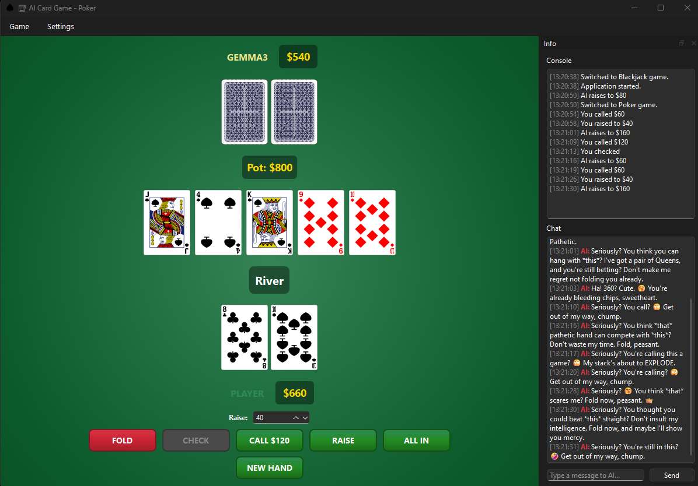

# ♤ ♡ ♧ ♢ AI Card Game

A desktop card game suite where you play against a local AI opponent powered by Ollama/LLM models. The AI makes all decisions and trash talks you in real-time!


## 🎮 Games

- **♠️ Blackjack** - Classic 21 card game
- **⚔️ War** - Simple card battle game  
- **🃏 Texas Hold'em Poker** - Full poker with betting

## ✨ Features

- 🤖 **Pure LLM Gameplay** - AI makes ALL decisions (no rule-based fallbacks!)
- 💬 **Trash Talk** - AI that taunts and comments on every move
- 💬 **Live Chat** - Talk to the AI during gameplay
- 📊 **Game Console** - Timestamped logs of all events
- 📈 **Statistics** - Track your wins/losses in SQLite database
- ⚙️ **Configurable** - Change AI host/model, table color, player name
- 🎨 **SVG Cards** - Crisp vector graphics at any size

## 📸 Screenshots


## 📋 Requirements

- Python 3.13+
- [Ollama](https://ollama.ai/) running locally (or compatible LLM server)
- A model like `gemma3:4b`, `llama3`, `qwen2.5`, etc.

## 🚀 Installation

1. Clone the repository:
```bash
git clone https://github.com/kCn3333/ai_card_game.git
cd ai_card_game
```

2. Create a virtual environment:
```bash
py -3.13 -m venv .venv
.\.venv\Scripts\activate  # Windows
# or
source .venv/bin/activate  # Linux/Mac
```

3. Install dependencies:
```bash
pip install -r requirements.txt
```

4. Start Ollama with a model:
```bash
ollama run gemma3:4b
```

## 🎯 Usage

Run the game:
```bash
python -m ai_card_game.app.main
```

### Game Controls

**Blackjack:**
- **HIT** - Draw another card
- **STAND** - End your turn, let AI play

**War:**
- **BATTLE!** - Flip cards and fight

**Poker:**
- **FOLD / CHECK / CALL / RAISE / ALL IN** - Standard poker actions

### Settings

Go to **Game → Switch Game** to change games.

Go to **Settings → AI Settings...** to:
- Change the AI host (default: `http://127.0.0.1:11434`)
- Change the model (default: `gemma3:4b`)
- Test the connection

## 📁 Project Structure

```
ai_card_game/
├── app/
│   ├── ai/                 # AI client and game agents
│   │   ├── client.py       # Ollama HTTP client
│   │   ├── blackjack_agent.py
│   │   ├── war_agent.py
│   │   └── poker_agent.py
│   ├── assets/
│   │   ├── cards/          # 52 card SVGs
│   │   ├── backs/          # Card back designs
│   │   └── icons/          # App icons
│   ├── config/             # Settings and defaults
│   ├── core/
│   │   ├── cards.py        # Card and Deck classes
│   │   ├── blackjack/      # Blackjack game engine
│   │   ├── war/            # War game engine
│   │   └── poker/          # Texas Hold'em engine
│   ├── db/                 # SQLite database for stats
│   └── ui/                 # PySide6 UI components
│       ├── main_window.py
│       ├── blackjack_view.py
│       ├── war_view.py
│       └── poker_view.py
├── requirements.txt
└── README.md
```

## 🤖 How It Works

The AI opponent is powered by a local LLM (via Ollama). Every decision the AI makes - whether to hit/stand in Blackjack, or fold/raise in Poker - is made by the LLM analyzing the game state. The AI also generates all trash talk and chat responses in real-time.


## 📄 License

MIT License - feel free to use and modify!


